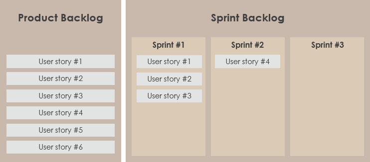
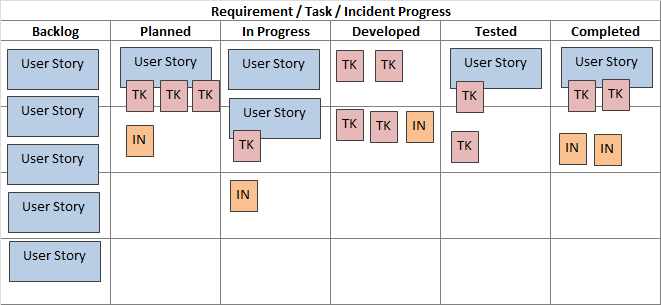
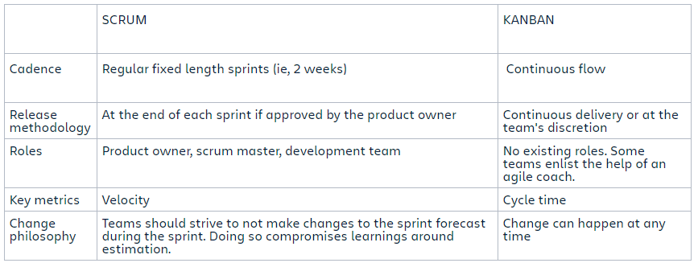

# Overview

# Agile

**What is Agile?**
- Agile is an iterative approach to project management and development. It replaces the outdated waterfall model with a more incremental process. With plans and features being continuously evaluated and changed to adapt to new insights, this allows a product to be more user-focused.
- Agile development refers to any development process that is aligned with the Agile manifesto.
- There are many advantages to Agile:
    1. Improved product quality
    2. A greater focus on business values and users
    3. Greater stakeholder engagement and transparency
    4. Predictable costs and time commitments
    5. Promotes and allows efficient automation
    6. Ease in adapting to change and difficulties
- But are there any downsides and reasons why one wouldn't choose to implement an Agile methodology?
    1. Harder for teams that are too experienced in a development model -- it's hard to change people's behavioural attitudes
    2. A lack of skilled product owners will seriously limit the effectiveness of the Agile model

 

**What are the four values of Agile?**
1. **Individuals and interactions over processes and tools**
    - It is the people who respond to business decisions; if the process or tools are the driver for development then the team is less responsive to change and less likely to satisfy customer needs.

2. **Working software over comprehensive documentation**
    - Agile documents requirements using user stores etc. which are sufficient for developers to build working iterations. This doesn't mean it disregards documentation altogether though, it does value it but it just values working software more.

3. **Customer collaboration over contract negotiation**
    - Allow the customer to be involved in the development process. This is juxtaposed with the waterfall model where customer needs were only really dealt with before and after the development process. This gives more transparency and allows the developers to really meet the customer's needs.

4. **Responding to change over following a plan**
    - Traditional software development meant following a detailed plan over a defined set of features. Agile allows one to do this while simultaneously allowing developers to adapt to changes and revelations in the product.

 
 

# Scrum

- Scrum replaces a programmed algorithmic approach with a heuristic one (i.e. a practical method that isn't exactly optimal, but sufficient in shorter time frames).
- A Scrum process is divided into three categories of Roles, Artifacts and Time Boxes.

    

- Agile is a methodology based on iterative and incremental development while Scrum is one it's many implementations based on delivering incremental builds in short time-frames called sprints.

 

**Scrum Roles**
1. **Product Owner**
    - Owns the Product backlog and writes user stores and the acceptance criteria.
    - Responsible for prioritising the product backlog and decides release dates.
    - Decides whether to accept or reject backlog items.
    - Responsible for the ROI (return on investment) of the product.
2. **Scrum Master**
    - A facilitator - they encourage self-organization and self-responsibility from the Scrum team. 
    - They act as the bridge for cooperation across all roles and functions.
    - Protects the team from distractions and fixes problems to allow the team to focus on the work set.
    - Not typically a manager or lead but an influential lead and coach who does not do direct command and control.
3. **Development Team**
    - The collection of individuals responsible for the development of the product.
    - Made up of cross-functional members such as Software Engineers, System Admins, QA testers, UX designers etc.
    - Will always include all expertise required for the product to be made shippable per iteration.
    - Self-organising with a very high degree of autonomy.
    - Most teams do not have a lead has decisions are taken as a team entirely.

 

**Scrum Artifacts**
1. **Product Backlog**
    - A complete list of all features known to be needed in the product. Constantly updated and never complete.
2. **Sprint Backlog**
    - A list of  everything that the team wants to accomplish in a given Sprint. Noone can add to the Sprint backlog once made except for the development team.
    - If something must be dropped from the backlog, the team must negotiate it with the product owner.
3. **Product Increment**
    - After every Sprint, the team must complete a version of the product that is potentially able to be released. If releasable, it must meet the DOD (definition of done).

 

**Scrum Ceremonies**
1. **Sprint Planning**
    - The Scrum team collaborates and discusses their expectations for what should be achieved during the sprint.
    - Involves the entire Scrum Team (PO, SM and the DT).
    - Should be a maximum of 8 hours, usually two hours for every one week of a sprint's length. This happens before every sprint starts.
    - Questions posed:
        1. "What can be delivered during this sprint?"
        2. "How will we accomplish that work?"
2. **Daily Scrum**
    - This is a daily meeting, usually for 15 minutes, to chart progress towards the Sprint goal. This is an opportunity for the DT to inspect and adapt the product and process on a daily basis.
    - The DT members must attend but optional for both the SM (usually attends) and the PO.
    - Questions posed:
        1. "How is the progress going?"
        2. "Any blockers from yesterday?"
3. **Sprint Review**
    - Focuses on the current iteration of the product. Stakeholders are invited and the DT discuss what happened during the development process in that Sprint. The product backlog is changed as necessary.
    - The entire Scrum team attends (PO, SM and the DT). Other stakeholders and other affected departments are also invited since this allows for more thorough and diverse feedback.
    - Rule of thumb is to allow one hour of sprint review per one week of a sprint's length.
    - Questions posed:
        1. "What happened during this sprint?"
        2. "Any big blockers?"
4. **Sprint Retrospective**
    - A discussion for the Scrum team about what went right and where they could improve. They will plan improvements they can implement.
    - Should be attended by both the DT and the SM, the PO is recommended to come bt not mandatory attendees.
    - Rule of thumb is to allow 45 minutes for every one week of a sprint's length.
    - Questions posed:
        1. "What problems did we have this sprint that we can try to avoid next time?"
        
 

**How have we implemented Agile?**
- Agile follows an iterative approach to product development while Scrum follows short time-frames of development followed by retrospectives. This allows many instances of incremental chanage.

 

**The Three Amigos**
- Refers to the primary perspectives to examine an increment of work before, during, and after development.

1. **Business**
    - What problem are we trying to solve?
2. **Development**
    - How might one build a solution to said problem?
3. **Testing**
    - Trying different approaches i.e. "if we do this, what could possibly happen?"

 

**What is an epic story?**
- An agile epic is a workload that can be broken down into smaller tasks called stories. They are broken down based on the specific needs of the customer or user.
- They often encompass multiple teams working on multiple projects.
- They are delivered over a set of sprints.
- Could include some time-scale for completion
- Use cases are the high level business goals that the end users wish to achieve by using the product.

 

**What is a user story?**
- A user story is a generalised explanation of a product feature written from the perspective of the end users.
- It is meant to explain how a specific feature provides the end users with value.
- The user story should allow people to choose specific features and requirements to be implemented.
- Each user story contributes to the completion of the epic story.
- D.O.D. is usually when the stated user can complete the outlined task.

 

**Planning Poker**
- This is an Agile estimating and planning technique that is consensus based.
    1. The PO reads a user story or describes a feature the estimators.
    2. Each estimator is holding a deck of Planning Poker cards with values, some commonly used ones are (0, 1, 2, 3, 5, 8, 13, 20, 40, 100). These represent the number of story points/ideal days/other units to estimate.
    3. The estimators will ask questions about the story/feature and each estimator will pick a card to represent their estimate. All cards are revealed at the same time.
    4. If all estimators agree on the same value, then that becomes the estimate. Otherwise the estimators discuss their estimates.
    5. After a further discussion, they will estimate again.
    6. This process is repeated until consensus is achieved or until the estimators decide to defer a decision on the story/feature.

 

**INVEST**
- A good user story should be:
    1. I - independent
    2. N - negotiable
    3. V - valuable
    4. E - estimable
    5. S - small
    6. T - testable

- These are criteria that a user story should aim to encompass. If a story does not do so, the team should reword or rewrite it completely. Following so encourages good habits which eliminate some flaws with user stories such as dependendies, being too big a project and being hard to test.

 
 

# Kanban 

**What is it?**
- It is a lean method that focuses on JIT (just-in-time) delivery of functionality and managing the amount of WIP (work in progress).
- There are physical cards called "Kanban" that move through the process from start to finish. The aim is to control and manage the flow of features so that the number of features being completed coincides with the number of features entering the process.

    

**How does it relate to Agile?**
- Unlike Scrum, Kanban is not an iterative process. It allows the product to be developed in a single large developmeny cycle.
- It is still an agile methodology, however, because it fulfils all twelve principles behind the Agile manifesto as whilst it is not iterative, it is incremental.
- What is the difference between the two?
    - Incremental refers to a developmental cycle being split into small bite-sized pieces (increments) with each one building on top of what has gone on before.
    - Iterative refers to a process of repeating and refining. Every iteration of a product builds upon the previous one. 

**Kanban vs. Scrum**
- Both are Agile methodologies that aim to improve processes and make development more efficient by reducing waste. They both foster transparency in the production allowing much more rigorous feedback, ultimately leading to a better product. To add, they are centered on organised teams that have a high level of autonomy.
- The areas where they differ are quite numerous. While Scrum pursues fast pace change, Kanban follows a slower change process. Scrum has time-boxed iterations for changes to occur but Kanban relies on a continuous flow and changes whenever is required. Whereas Scrum releases after every sprint, Kanban can release continuously or at the team's discretion. There are also no pre-existing roles within Kanban.

 

**Kanban or Scrum?**
- Use Scrum for feature-driven work with big release goals ore milestones.
- Use Kanban for incoming small pieces of work such as defect fixes or small enhancement requests.
- Advisable to apply bits of both, such as Scrum alongside the visual aspects of Kanban.
    

---
**Used:**
- [Agile Manifesto](https://agilemanifesto.org/)

- [Advantages/Disadvantages of Agile](https://www.blueprintsys.com/agile-development-101/agile-benefits-and-challenges)

- [Four values of Agile](https://www.smartsheet.com/comprehensive-guide-values-principles-agile-manifesto)

- [What is Scrum?](https://www.scrum.org/resources/what-is-scrum)

- [Scrum Roles](https://www.visual-paradigm.com/scrum/what-are-the-three-scrum-roles/#:~:text=The%20roles%20in%20Scrum%20are,known%20as%20the%20Scrum%20Team.)

- [Scrum Artifacts](https://www.scrumalliance.org/about-scrum/artifacts#:~:text=Scrum%20defines%20three%20artifacts%3A%20Product,a%20potentially%20releasable%20product%20increment.)

- [Scrum Events](https://www.scrumalliance.org/about-scrum/events)

- [Three Amigos](https://www.agilealliance.org/glossary/three-amigos/#q=~(infinite~false~filters~(postType~(~'page~'post~'aa_book~'aa_event_session~'aa_experience_report~'aa_glossary~'aa_research_paper~'aa_video)~tags~(~'three*20amigos))~searchTerm~'~sort~false~sortDirection~'asc~page~1))

- [Epic and User stories](https://github.com/jaredsparta/epic_and_user_stories)

- [Planning Poker](https://www.mountaingoatsoftware.com/agile/planning-poker#:~:text=Planning%20Poker%20is%20an%20agile,a%20feature%20to%20the%20estimators.)

- [INVEST](https://agileforall.com/new-to-agile-invest-in-good-user-stories/)

- [Kanban](https://www.inflectra.com/methodologies/kanban.aspx)

- [Kanban or Scrum?](https://www.planview.com/resources/guide/introduction-to-kanban/kanban-vs-scrum/)